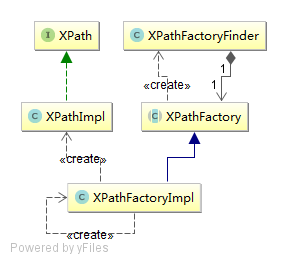
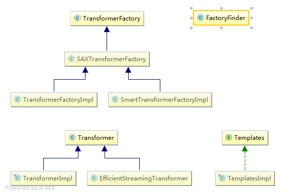

抽象工厂模式（abstract factory pattern）

所要生产的对象

```java
public interface XPath {...}
public class XPathImpl implements javax.xml.xpath.XPath {...}
```

`XpathImpl`即`com.sun.org.apache.xpath.internal.jaxp.XPathImpl`


工厂

```java
public abstract class XPathFactory {
  	protected XPathFactory() {
    }
  	public static XPathFactory newInstance() {
        try {
             return newInstance(DEFAULT_OBJECT_MODEL_URI);
        } catch (XPathFactoryConfigurationException xpathFactoryConfigurationException) {
        }
    }
  	public static XPathFactory newInstance(final String uri)
        throws XPathFactoryConfigurationException {
		ClassLoader classLoader = ss.getContextClassLoader();
        XPathFactory xpathFactory = new XPathFactoryFinder(classLoader).newFactory(uri);
        return xpathFactory;
    }
  	public static XPathFactory newInstance(String uri, String factoryClassName, ClassLoader classLoader)
        throws XPathFactoryConfigurationException{
        ClassLoader cl = classLoader;
		XPathFactory f = new XPathFactoryFinder(cl).createInstance(factoryClassName);
    }
  	public abstract XPath newXPath();
}

public  class XPathFactoryImpl extends XPathFactory {
  	public javax.xml.xpath.XPath newXPath() {
            return new com.sun.org.apache.xpath.internal.jaxp.XPathImpl(
                    xPathVariableResolver, xPathFunctionResolver,
                    !_isNotSecureProcessing, _useServicesMechanism,
                    _featureManager );
    }
}
```

`com.sun.org.apache.xpath.internal.jaxp.XPathImpl`就是所要生产的对象。注意在XPathFactory#newInstance中，通过XPathFactoryFinder#newFactory或者#createInstance生成了XPathPactory。


创建工厂(FactoryFinder or FactoryBuilder)

```java
class XPathFactoryFinder  {
  	public XPathFactory newFactory(String uri) throws XPathFactoryConfigurationException {...}
  	XPathFactory createInstance( String className ) throws XPathFactoryConfigurationException{...}
}
```

使用：

```java
XPathFactory xpf = XPathFactory.newInstance();
XPath xpath = xpf.newXPath();
```


对应UML图：




上面的例子只有一个生产对象XPath，再举一个例子。



生产的对象

```java
public abstract class Transformer {}
public final class TransformerImpl extends Transformer
    implements DOMCache, ErrorListener{}
public class EfficientStreamingTransformer extends Transformer {}
```

```java
public interface Templates {}
public final class TemplatesImpl implements Templates, Serializable {}
```


工厂

```java
public abstract class TransformerFactory {
  	protected TransformerFactory() { }
  	public static TransformerFactory newInstance() throws TransformerFactoryConfigurationError {
        return FactoryFinder.find(
            /* The default property name according to the JAXP spec */
            TransformerFactory.class,
            /* The fallback implementation class name, XSLTC */
            "com.sun.org.apache.xalan.internal.xsltc.trax.TransformerFactoryImpl");
    }
  	public static TransformerFactory newInstance(String factoryClassName, ClassLoader classLoader) throws TransformerFactoryConfigurationError{
        return  FactoryFinder.newInstance(TransformerFactory.class,
                    factoryClassName, classLoader, false, false);
    }
  	public abstract Templates newTemplates(Source source) throws TransformerConfigurationException;
  public abstract Transformer newTransformer(Source source) throws TransformerConfigurationException;
  public abstract Transformer newTransformer() throws TransformerConfigurationException;
  
}
```

子类`TransformerFactoryImpl`和`SmartTransformerFactoryImpl`分别实现了abstract方法。`SAXTransformerFactory`也是抽象工厂。

在TransformerFactory#newInstance中使用javax.xml.transform.FactoryFinder#find或者#newInstance得到工厂

```java
class FactoryFinder {
  	static <T> T find(Class<T> type, String fallbackClassName) throws TransformerFactoryConfigurationError{}
  	static <T> T newInstance(Class<T> type, String className, ClassLoader cl, boolean doFallback, boolean useServicesMechanism) throws TransformerFactoryConfigurationError{}
}
```


使用：

```java
TransformerFactory tfactory;
tfactory = TransformerFactory.newInstance();
Templates stylesheet=tfactory.newTemplates(new DOMSource(xslDOM,xslFileName));
SAXTransformerFactory stf = (SAXTransformerFactory) tfactory;
Transformer serializer = stf.newTransformer();
```

