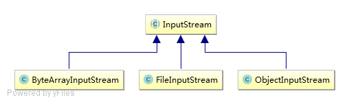
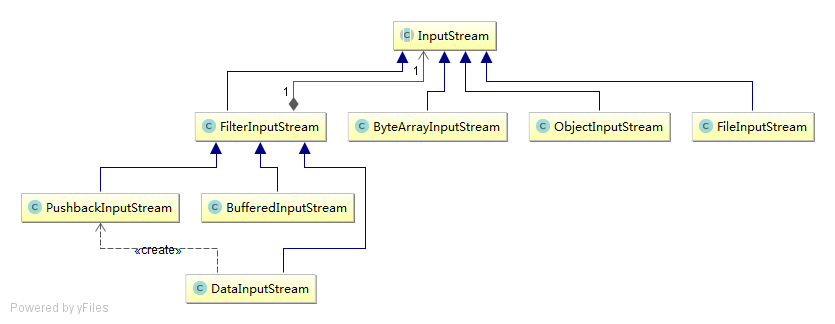

装饰器模式

定义：装饰模式是在**不必改变原类文件**和**不使用继承**的情况下，**动态的扩展**一个对象的功能。它是通过创建一个包装对象，也就是装饰来包裹真实的对象。

通过java io来学习装饰器模式

java.io.InputStream.java 有很多子类，下面的图列出其中的三种：



ByteArrayInputStream: A ByteArrayInputStream contains an internal buffer that contains bytes that may be read from the stream.

FileInputStream: A FileInputStream obtains input bytes from a file in a file system.

ObjectInputStream: An ObjectInputStream deserializes primitive data and objects previously written using an ObjectOutputStream.

现在要为这三个类增加缓存功能，一般的做法是修改每个类或者修改他们的父类InputStream。或者生成一个ByteArrayInputStream的子类实现缓存功能。

如果修改InputStream，不断地添加新功能，会使InputStream变得臃肿，而且如果想让ObjectInputStream不具有数据缓存功能时，还需要修改ObjectInputStream，例如覆盖父类中相应的方法。如果修改每一个类或者生成子类，会增加很多重复代码。

装饰器模式如下图所示：



没有改变原有的类，在左边部分怎加了装饰器。

InputStream.java

```java
public abstract class InputStream implements Closeable {
    private static final int MAX_SKIP_BUFFER_SIZE = 2048;
    public abstract int read() throws IOException;
  	public int read(byte b[], int off, int len) throws IOException {...}
}
```


FilterInputStream.java内容如下：

```java
public class FilterInputStream extends InputStream {
  	protected volatile InputStream in;
  	protected FilterInputStream(InputStream in) {
        this.in = in;
    }
  	//下面部分只是通过in调用相应的方法
  	public int read() throws IOException {
        return in.read();
    }
  	public int read(byte b[], int off, int len) throws IOException {
        return in.read(b, off, len);
    }
    ...
}
```

定义了一个InputStream类型的成员`in`

BufferedInputStreram.java

```java
public class BufferedInputStream extends FilterInputStream {
  	private static int DEFAULT_BUFFER_SIZE = 8192;
  	public BufferedInputStream(InputStream in) {
        this(in, DEFAULT_BUFFER_SIZE);
    }
  	public BufferedInputStream(InputStream in, int size) {
        super(in);
        if (size <= 0) {
            throw new IllegalArgumentException("Buffer size <= 0");
        }
        buf = new byte[size];
    }
  	public synchronized int read() throws IOException {
        if (pos >= count) {
            fill();
            if (pos >= count)
                return -1;
        }
        return getBufIfOpen()[pos++] & 0xff;
    }
  
  	private InputStream getInIfOpen() throws IOException {
        InputStream input = in;
        if (input == null)
            throw new IOException("Stream closed");
        return input;
    }
    private void fill() throws IOException {
        byte[] buffer = getBufIfOpen();
        if (markpos < 0)
            pos = 0;            /* no mark: throw away the buffer */
        else if (pos >= buffer.length)  /* no room left in buffer */
            if (markpos > 0) {  /* can throw away early part of the buffer */
                int sz = pos - markpos;
                System.arraycopy(buffer, markpos, buffer, 0, sz);
                pos = sz;
                markpos = 0;
            } else if (buffer.length >= marklimit) {
                markpos = -1;   /* buffer got too big, invalidate mark */
                pos = 0;        /* drop buffer contents */
            } else if (buffer.length >= MAX_BUFFER_SIZE) {
                throw new OutOfMemoryError("Required array size too large");
            } else {            /* grow buffer */
                int nsz = (pos <= MAX_BUFFER_SIZE - pos) ?
                        pos * 2 : MAX_BUFFER_SIZE;
                if (nsz > marklimit)
                    nsz = marklimit;
                byte nbuf[] = new byte[nsz];
                System.arraycopy(buffer, 0, nbuf, 0, pos);
                if (!bufUpdater.compareAndSet(this, buffer, nbuf)) {
                    throw new IOException("Stream closed");
                }
                buffer = nbuf;
            }
        count = pos;
        int n = getInIfOpen().read(buffer, pos, buffer.length - pos);
        if (n > 0)
            count = n + pos;
    }
}
```

通过`super(in);`为父类FilterInputStream的成员`in`赋值。

例如对于FileInputStream.java

```java
public class FileInputStream extends InputStream{
  	public int read() throws IOException {
        return read0();
    }
    private native int read0() throws IOException;
  	
  	public int read(byte b[], int off, int len) throws IOException {
        return readBytes(b, off, len);
    }
  	private native int readBytes(byte b[], int off, int len) throws IOException;
  
}
```


```java
final String filePath = "E:/test.txt";
InputStream inputStream = new FileInputStream(filePath);
inputStream.read();
```

此时从文件中读取

```java
BufferedInputStream bufferedInputStream = new BufferedInputStream(inputStream);
bufferedInputStream.read();
```

这样就为FileInputSteam提供了buffer功能。可以看到在fill()函数中，通过`int n = getInIfOpen().read(buffer, pos, buffer.length - pos);`实际上是调用FileInputStream中的方法，从文件中读取内容。

bufferedInputStream还可以传入到DataInputStream中，再进行一层包装。

最后借用http://www.cnblogs.com/zuoxiaolong/p/pattern11.html上面的例子

```java
package com.decorator;

import java.io.BufferedInputStream;
import java.io.BufferedReader;
import java.io.DataInputStream;
import java.io.FileInputStream;
import java.io.IOException;
import java.io.InputStream;
import java.io.InputStreamReader;
import java.io.LineNumberReader;
import java.io.PushbackInputStream;
import java.io.PushbackReader;

public class IOTest {

    /* test.txt内容：
     * hello world!
     */
    public static void main(String[] args) throws IOException, ClassNotFoundException {
        //文件路径可自行更换
        final String filePath = "E:/myeclipse project/POITest/src/com/decorator/test.txt";
        
        //InputStream相当于被装饰的接口或者抽象类，FileInputStream相当于原始的待装饰的对象，FileInputStream无法装饰InputStream
        //另外FileInputStream是以只读方式打开了一个文件,并打开了一个文件的句柄存放在FileDescriptor对象的handle属性
        //所以下面有关回退和重新标记等操作，都是在堆中建立缓冲区所造成的假象,并不是真正的文件流在回退或者重新标记
        InputStream inputStream = new FileInputStream(filePath);
        final int len = inputStream.available();//记录一下流的长度
        System.out.println("FileInputStream不支持mark和reset：" + inputStream.markSupported());
        
        System.out.println("---------------------------------------------------------------------------------");
        
        /* 下面分别展示三种装饰器的作用BufferedInputStream,DataInputStream,PushbackInputStream,LZ下面做了三个装饰器的功能演示  */
        
        //首先装饰成BufferedInputStream，它提供我们mark，reset的功能
        BufferedInputStream bufferedInputStream = new BufferedInputStream(inputStream);//装饰成 BufferedInputStream
        System.out.println("BufferedInputStream支持mark和reset：" + bufferedInputStream.markSupported());
        bufferedInputStream.mark(0);//标记一下
        char c = (char) bufferedInputStream.read();
        System.out.println("LZ文件的第一个字符：" + c);
        bufferedInputStream.reset();//重置
        c = (char) bufferedInputStream.read();//再读
        System.out.println("重置以后再读一个字符，依然会是第一个字符:" + c);
        bufferedInputStream.reset();
        
        System.out.println("---------------------------------------------------------------------------------");
        
        //装饰成 DataInputStream,我们为了又使用DataInputStream,又使用BufferedInputStream的mark reset功能，所以我们再进行一层包装
        //注意，这里如果不使用BufferedInputStream，而使用原始的InputStream，read方法返回的结果会是-1，即已经读取结束
        //因为BufferedInputStream已经将文本的内容读取完毕，并缓冲到堆上，默认的初始缓冲区大小是8192B
        DataInputStream dataInputStream = new DataInputStream(bufferedInputStream);
        dataInputStream.reset();//这是BufferedInputStream提供的功能，如果不在这个基础上包装会出错
        System.out.println("DataInputStream现在具有readInt，readChar,readUTF等功能");
        int value = dataInputStream.readInt();//读出来一个int,包含四个字节
        //我们转换成字符依次显示出来，可以看到LZ文件的前四个字符
        String binary = Integer.toBinaryString(value);
        int first = binary.length() % 8;
        System.out.print("使用readInt读取的前四个字符：");
        for (int i = 0; i < 4; i++) {
            if (i == 0) {
                System.out.print(((char)Integer.valueOf(binary.substring(0, first), 2).intValue()));
            }else {
                System.out.print(((char)Integer.valueOf(binary.substring(( i - 1 ) * 8 + first, i * 8 + first), 2).intValue()));
            }
        }
        System.out.println();
        
        System.out.println("---------------------------------------------------------------------------------");
        
        //PushbackInputStream无法包装BufferedInputStream支持mark reset，因为它覆盖了reset和mark方法
        //因为流已经被读取到末尾，所以我们必须重新打开一个文件的句柄，即FileInputStream
        inputStream = new FileInputStream(filePath);
        PushbackInputStream pushbackInputStream = new PushbackInputStream(inputStream,len);//装饰成 PushbackInputStream
        System.out.println("PushbackInputStream装饰以后支持退回操作unread");
        byte[] bytes = new byte[len];
        pushbackInputStream.read(bytes);//读完了整个流
        System.out.println("unread回退前的内容：" + new String(bytes));
        pushbackInputStream.unread(bytes);//再退回去
        bytes = new byte[len];//清空byte数组
        pushbackInputStream.read(bytes);//再读
        System.out.println("unread回退后的内容：" + new String(bytes));
        
        System.out.println("---------------------------------------------------------------------------------");
        
        /*  以上有两个一层装饰和一个两层装饰,下面我们先装饰成Reader，再进行其它装饰   */
        
        //由于之前被PushbackInputStream将流读取到末尾，我们需要再次重新打开文件句柄
        inputStream = new FileInputStream(filePath);
        InputStreamReader inputStreamReader = new InputStreamReader(inputStream,"utf-8");//先装饰成InputStreamReader
        System.out.println("InputStreamReader有reader的功能，比如转码：" + inputStreamReader.getEncoding());
        
        System.out.println("---------------------------------------------------------------------------------");
        
        BufferedReader bufferedReader = new BufferedReader(inputStreamReader);//我们进一步在reader的基础上装饰成BufferedReader
        System.out.println("BufferedReader有readLine等功能：" + bufferedReader.readLine());
        
        System.out.println("---------------------------------------------------------------------------------");
        
        LineNumberReader lineNumberReader = new LineNumberReader(inputStreamReader);//我们进一步在reader的基础上装饰成LineNumberReader
        System.out.println("LineNumberReader有设置行号，获取行号等功能（行号从0开始）,当前行号：" + lineNumberReader.getLineNumber());
        
        System.out.println("---------------------------------------------------------------------------------");
        
        //此处由于刚才被readLine方法将流读取到末尾,所以我们再次重新打开文件句柄,并需要将inputstream再次包装成reader
        inputStreamReader = new InputStreamReader(new FileInputStream(filePath));
        PushbackReader pushbackReader = new PushbackReader(inputStreamReader,len);//我们进一步在reader的基础上装饰成PushbackReader
        System.out.println("PushbackReader是拥有退回操作的reader对象");
        char[] chars = new char[len];
        pushbackReader.read(chars);
        System.out.println("unread回退前的内容：" + new String(chars));
        pushbackReader.unread(chars);//再退回去
        chars = new char[len];//清空char数组
        pushbackReader.read(chars);//再读
        System.out.println("unread回退后的内容：" + new String(chars));
    }
}
```

